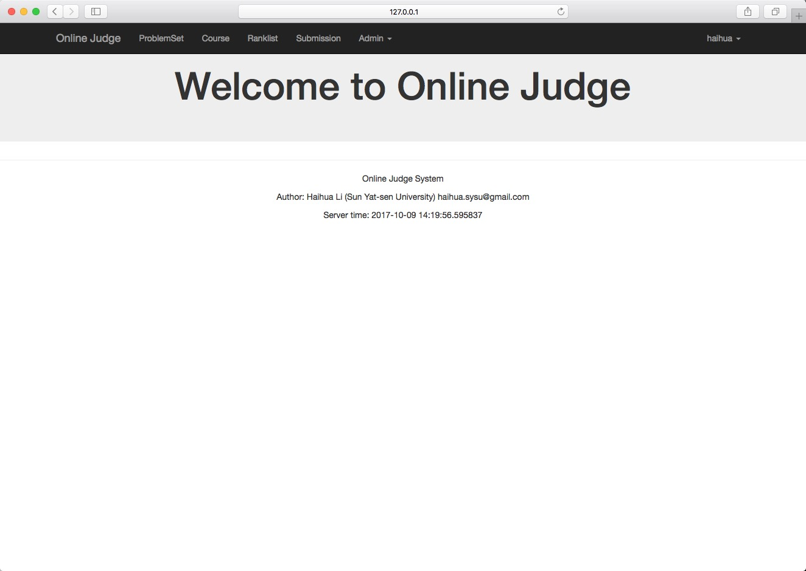

# onlinejudge

## Requirements

- Install django 1.8.1
    - pip install Django==1.8.1
- Install django-taggit
    - pip install django-taggit

## Run the web server

Migrates the database before serve the online judge system. Use command `python manager.py migrate` in the root directory of the web. The default db engine is sqlite3,
you could config the db engine in `untitle_oj/settings.py`. Excatually, the judge backend uses mysql as the sql client, it's better to change the webserver's db engine
to mysql.

After migrated the db, uses `python manager.py runserver` to run the webserver. The default hostname is `127.0.0.1` and the port is `8000`, you will see the successful
message from the terminal. Screenshoot should look like: 
